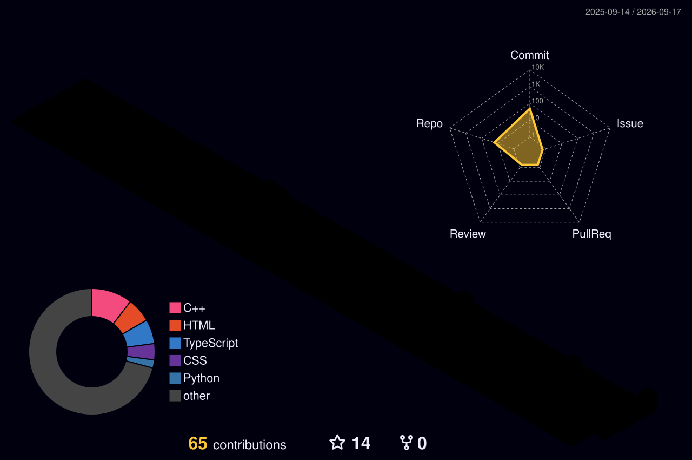

<div align="center">


<br/>

<!-- Windows Terminal style intro -->
<a href="#">
  
</a>


<a href="https://instagram.com/himansini._.09"></a>
<a href="mailto:himansinipanda@gmail.com"></a>

</div>

---

### 👩‍💻 About Me
<table>
<tr>
<td width="55%">

```bash
┌──(himansini㉿secure)-[~]
└─$ whoami

  Name     : Himansini Panda
  Role     : Computer Science and Engineering Student
  Location : Cuttack, Odisha, India
  Focus    : - Python, Git & Open Source
             - Secure Coding (C · C++ · Python)
  Status   : 🎯 Focusing — Learning. Securing. Building.
  Fun Fact : I'm fascinated by how systems break
             so I can learn to protect them 🔐
```
</td>
<td width="45%" align="center">

### ⚡ Quick Facts
- 🌱 Currently learning **CS & Engineering**
- 🚀 Exploring **Python · Git · Open Source**
- 📬 **himansinipanda@gmail.com**

</td>
</tr>
</table>

---

### 📊 GitHub Statistics

<div align="center">


<br/>


</div>

**🧱 3D Contribution Blocks** *(one-time setup needed — see notes below)*

```

```

---

### 🏆 GitHub Trophies

<div align="center">

</div>

---

### 🛠️ Tech Stack & Tools
<p align="center">Floating on loop — my everyday toolkit 👇</p>

<div align="center">
<marquee behavior="scroll" direction="left" scrollamount="6">

</marquee>
</div>


---

### 🐍 Contribution Snake

<div align="center">

<picture>
  <source media="(prefers-color-scheme: dark)" srcset="https://raw.githubusercontent.com/himansinipanda/himansinipanda/output/github-contribution-grid-snake-dark.svg" />
  <source media="(prefers-color-scheme: light)" srcset="https://raw.githubusercontent.com/himansinipanda/himansinipanda/output/github-contribution-grid-snake.svg" />
  
</picture>

*(Generated automatically once the Snake Action below is set up)*

</div>

---


</div>


<div align="center">

### ✍️ Quote of the Day

> *"Security is not a product, but a process."* — **Bruce Schneier**

</div>

---

## ⚡ Fun Zone

<div align="center">

```
╔══════════════════════════════════════════════════════════╗
║   "Stay curious. Stay secure. Stay coding."               ║
║                                    — Himansini Panda       ║
╚══════════════════════════════════════════════════════════╝
```

</div>
